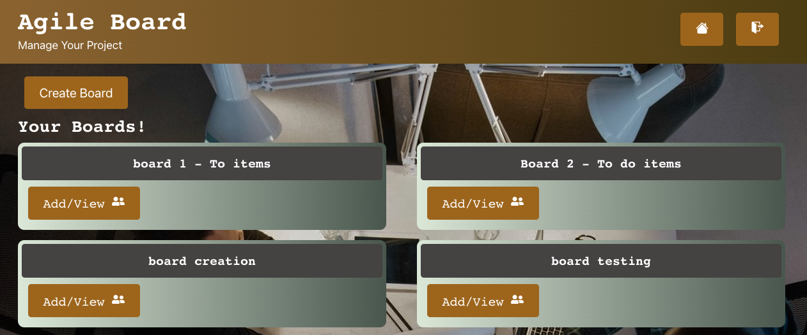

# Agile Board

## Description
* From professional to personal, this agaile board would help users to plan and track progress of project.

## Table to contents

-[Description](#description)

-[Acceptance Criteria](#acceptance-criteria)

-[Installation Steps](#installation-steps)

-[Database](#database)

-[Mock-up Screen](#mock-up-screen)

## Acceptance-criteria

* Given a Agile Board application:
* WHEN user opens the Agile Board app, THEN user is presented with a landing page that displays title and option to Signup/Login.
* WHEN user clicks on Signup/Login - credentials are validated (User model) and unique taken is generated using JWT.
* WHEN user credentials are validated, home page is displayed with the create board button and any existing boards/projects.
* WHEN user clicks on create board, a form is displayed to enter title for board and data gets updated to Board model.
* WHEN user clicks on add/view member icon, user will be able to enter the email id of other user to share the board. 
* WHEN user clicks on any existing board, it takes to new page which displays all lists and respective cards for that board.
* User will have option to Add new list or Add new card to existing lists.
* WHEN user clicks on Add list, a form opens up to get the title of the list and data gets updated to List model.
* WHEN user clicks on Add card, a pop up opens up to get the title of the card and data gets updated to Card model.
* User will be presented with an option to edit or delete a card.
* WHEN user clicks on the edit card icon, user will be presented with a pop up form that displays existing card title and option to enter description for the card - details will get updated to Card model. 
* WHEN user clicks on the delete icon, card will get deleted from the list. 
* User will also have option to drag and drop a card from on list to another list. 

## Installation steps

* install the following:
npm init

* To invoke, in terminal give command - npm run develop 

* Future development: 
 - Assign members to card 
 - Move the list/board to archived folder
 - Email notification when any card/board is shared/added to user

 ## Database 

 
 
 ## Mock-up screen

### Github URL: 
https://github.com/Sivaparam/agile-board

### Live URL: 
https://agile-board-application.herokuapp.com/

### Contributors: 
 - Aldo Pelayo || Github: aldopelayo
 - Shubhra Salunke || Github: shubhra8
 - Sivaranjani Jayaprakash || Github: Sivaparam

